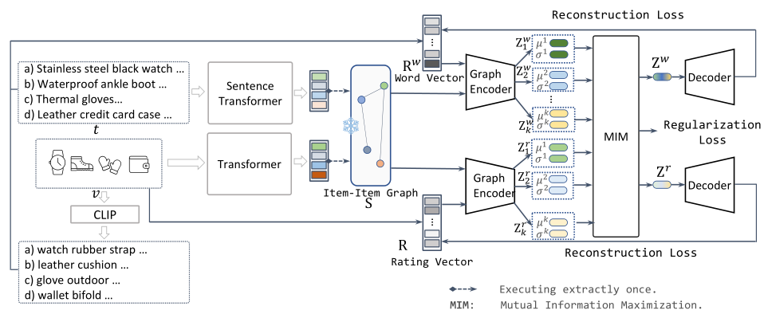
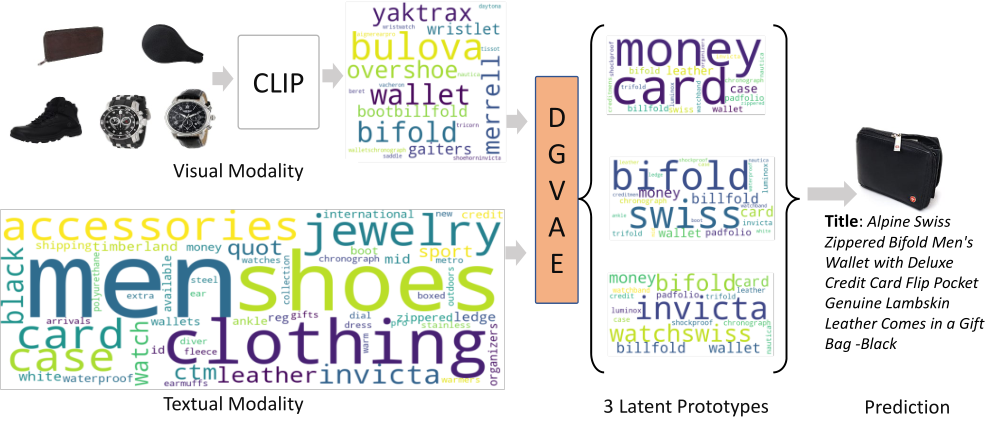

## Disentangled Graph Variational Auto-Encoder for Multimodal Recommendation with Interpretability, TMM'24

### Abstract
Multimodal recommender systems amalgamate multimodal information (e.g., textual descriptions, images) into a collaborative filtering framework to provide more accurate recommendations. While the incorporation of multimodal information could enhance the interpretability of these systems, current multimodal models represent users and items utilizing entangled numerical vectors, rendering them arduous to interpret.
To address this, we propose a Disentangled Graph Variational Auto-Encoder (`DGVAE`) that aims to enhance both model and recommendation interpretability. `DGVAE` initially projects multimodal information into textual contents, such as converting images to text, by harnessing state-of-the-art multimodal pre-training technologies. It then constructs a frozen item-item graph and encodes the contents and interactions into two sets of disentangled representations utilizing a simplified residual graph convolutional network. `DGVAE` further regularizes these disentangled representations through mutual information maximization, aligning the representations derived from the interactions between users and items with those learned from textual content.
This alignment facilitates the interpretation of user binary interactions via text. Our empirical analysis conducted on three real-world datasets demonstrates that `DGVAE` significantly surpasses the performance of state-of-the-art baselines by a margin of 10.02%.
We also furnish a case study from a real-world dataset to illustrate the interpretability of `DGVAE`.   

Full paper: [arXiv](https://arxiv.org/abs/2402.16110).

### Model Arch.

Fig. 1. The framework of `DGVAE`, which fully utilizes multimodal information to construct the word vector and the item-item graph. `DGVAE` learns its model parameters by reconstructing both the word vector and the rating vector of a user.

### Performance on `Baby` Dataset

| **Metric**                     |     **R@10**      |     **R@20**      |     **N@10**      |      **N@20**      | 
|--------------------------------|:-----------------:|:-----------------:|:-----------------:|:------------------:|
| Multi-VAE                      |      0.0353       |      0.0579       |      0.0189       |       0.0248       |   
| MacridVAE                      |      0.0463       |      0.0703       |      0.0264       |       0.0327       |     
| DGCF                           |      0.0441       |      0.0709       |      0.0239       |       0.0308       |      
| LightGCN                       |      0.0479       |      0.0754       |      0.0257       |       0.0328       |      
| VBPR                           |      0.0423       |      0.0663       |      0.0223       |       0.0284       |      
| MMGCN                          |      0.0421       |      0.0660       |      0.0220       |       0.0282       |      
| GRCN                           |      0.0532       |      0.0824       |      0.0282       |       0.0358       |      
| DualGNN                        |      0.0513       |      0.0803       |      0.0278       |       0.0352       |      
| LATTICE                        |      0.0547       |      0.0850       |      0.0292       |       0.0370       |       
| MVGAE(w/o POE)                 |      0.0307       |      0.0520       |      0.0151       |       0.0206       |   
| SLMRec                         |      0.0521       |      0.0772       |      0.0289       |       0.0354       |     
| BM3                            | <ins>0.0564</ins> | <ins>0.0883</ins> |      0.0301       |       0.0383       |      
| DMRL                           |      0.0543       |      0.0847       | <ins>0.0322</ins> |  <ins>0.0405</ins> | 
| `DGVAE`                        |    **0.0636**     |    **0.1009**     |    **0.0340**     |     **0.0436**     |  
| | | | |
| _improv._                      |      12.77%       |      14.27%       |       5.59%       |       7.65%        |      

### Interpretability

Fig. 2. An illustration of interpretability of `DGVAE`. The left part shows the interacted items by user `A1E3O99XB3BN3W`. The middle part visualizes the learned latent prototypes of `DGVAE`. The right part presents the learned prototypes and the recommended item.

### How to run
After install `requirements.txt`, simply run `./run-baby.sh`

